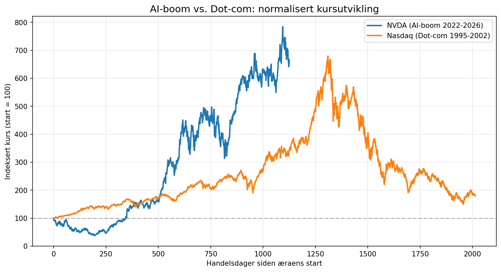
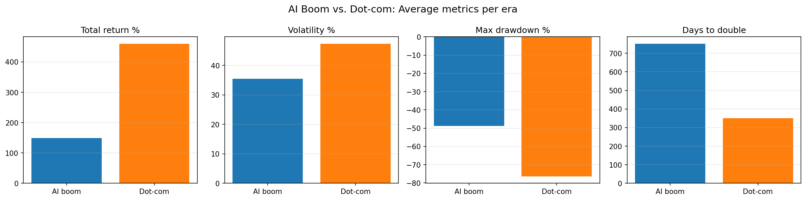

# bubble-meter

**Data center spending passed $700B in 2026. Is this 1999 all over again?**

`bubble-meter` is a quantitative tool that compares the 2026 AI boom to the
dot-com bubble using historical price data. It measures four independent bubble
signals across both eras, combines three of them into a single transparent
"bubble score," and lets the numbers speak for themselves.

## What it measures

For each stock in each era, the tool computes four metrics from daily price data:

- **Total return** — percentage growth from the first to the last trading day.
- **Annualized volatility** — how much the stock swings, scaled to a yearly figure (daily standard deviation × √252).
- **Max drawdown** — the largest peak-to-trough fall, in percent. The clearest signal of how brutally a bubble bursts.
- **Days to double** — trading days for the price to first double from its start. A proxy for mania.

## The comparison



Both eras indexed to 100 at their starting point and plotted on a shared
"days since start" axis, so they can be compared directly regardless of the
thirty years between them.



Averaged across each era's tickers, every one of the four signals points the
same way: the dot-com era was more extreme.

## Results

**AI boom (2022–2026)**

| Ticker | Total return % | Volatility % | Max drawdown % | Days to double |
|--------|---------------:|-------------:|---------------:|---------------:|
| NVDA   | 566.4 | 52.4 | -62.7 | 516 |
| MSFT   | 15.7  | 27.7 | -35.6 | —   |
| GOOGL  | 148.7 | 32.5 | -43.6 | 967 |
| AMZN   | 39.9  | 36.8 | -52.0 | —   |
| META   | 67.8  | 45.6 | -73.7 | 770 |
| ^GSPC  | 56.3  | 17.4 | -25.4 | —   |

**Dot-com (1995–2002)**

| Ticker | Total return % | Volatility % | Max drawdown % | Days to double |
|--------|---------------:|-------------:|---------------:|---------------:|
| CSCO   | 584.1  | 55.9 | -89.3 | 171 |
| INTC   | 302.4  | 51.0 | -82.2 | 117 |
| MSFT   | 601.1  | 40.5 | -65.2 | 360 |
| ORCL   | 416.7  | 63.1 | -84.2 | 374 |
| QCOM   | 1141.2 | 70.7 | -86.8 | 156 |
| ^GSPC  | 91.5   | 19.1 | -49.1 | 635 |
| ^IXIC  | 80.1   | 30.9 | -77.9 | 637 |

## Bubble score

| Era | Bubble score |
|-----|-------------:|
| AI boom (2022–2026) | **39.3 / 100** |
| Dot-com (1995–2002) | **66.8 / 100** |

The bubble score combines three signals — volatility, max drawdown, and
doubling speed — each normalized to a 0–1 range and averaged, then scaled to
0–100. Higher means more bubble-like.

Total return is **deliberately excluded**: high returns alone don't distinguish
a bubble from genuine growth. Amazon rose enormously in the dot-com era and was
not a bubble that vanished. What marks a bubble is *instability* and *mania* —
wild swings, brutal drawdowns, and manic doubling speed — which is exactly what
the three chosen signals capture.

## Key finding

Measured on volatility, drawdown, and doubling speed, the 2026 AI boom has so
far been **markedly less extreme** than the dot-com bubble — a bubble score of
39 versus 67. Dot-com leaders fell 82–89% from peak (CSCO −89%, QCOM −87%)
against 35–74% for AI-era stocks, and doubled far faster — some in under 170
trading days, versus 500–970 in the AI era.

But the first chart shows the crucial caveat directly: the dot-com curve traces
a **completed cycle** — rise, peak, collapse — while the AI curve still shows
only the rise. The comparison is between a finished story and an unfinished one.
The dot-com numbers include the crash; the AI numbers can't, because any crash
hasn't happened yet. On the evidence so far, 2026 does not resemble 1999 as
closely as popular comparisons claim — but the era is not over, so a hard
verdict would be premature.

## Limitations

An honest analysis names its own blind spots:

- **No valuation data.** The tool measures price behavior, not fundamentals. Historical P/E ratios aren't included (Cisco peaked near 200x in 2000; Nvidia around 50–75x in 2024–25), so it can't judge whether prices were justified by earnings.
- **Survivorship bias.** The dot-com sample contains companies that *survived*. The ones that went to zero (Pets.com, Webvan) aren't in the dataset, which makes that era look *less* severe than it actually was.
- **Single-name vs. index.** The headline chart compares one stock (NVDA) against an index (Nasdaq), which isn't a like-for-like match.
- **Unfinished era.** The AI-era metrics describe a story still in progress, not a completed cycle.

## How to run

```bash
python src/main.py
```

Requires `pandas` and `numpy`. Price data is included in `data/` (downloaded via
yfinance), so the analysis is fully reproducible offline.

## Project structure

```
bubble-meter/
├── src/
│   ├── era.py       # Era class: loads and serves price data
│   ├── metrics.py   # the four metrics + bubble score
│   └── main.py      # runs the full analysis
├── data/
│   ├── ai/          # 2022-2026 CSVs
│   └── dotcom/      # 1995-2002 CSVs
├── comparison.png
└── metrics_comparison.png
```
